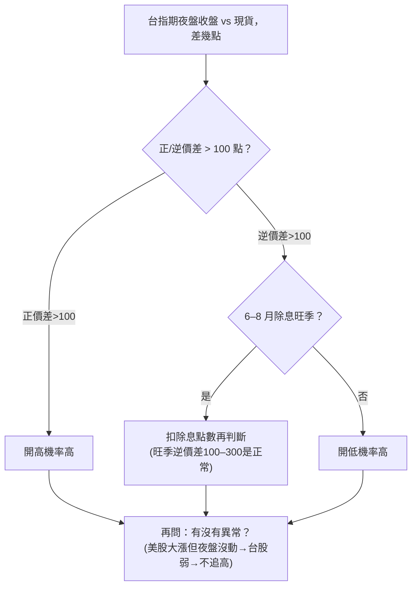
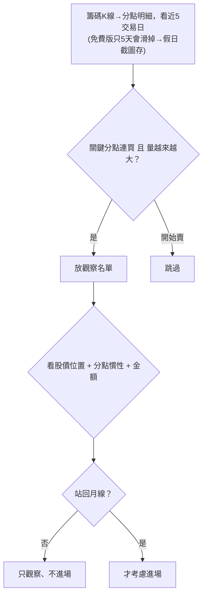

# 發想原文的判斷邏輯與訊號權重（完整版）

> 來源：使用者提供的完整原文〈我賣掉房子才學會的開盤前三件事〉。整理日期 2026-06-16。
> 對照代碼實作見 `docs/logic_code.md`。

## 0. 框架與心法（先讀這段）

- **背景**：作者 2022 All in 長榮被斷頭賠 400 萬、賣房、還債（每月 3.5 萬、剩 150 萬）。
  「開盤前沒做完這三件事，絕不按滑鼠。不是紀律，是怕了。」
- **本質**：這是一張**開盤前檢查清單**（三件事約 30 分鐘），**不是計分模型**。
  做完之後才看新聞/討論區，然後「**心裡有個底，知道今天風往哪吹**」，在筆記本寫**一句話**
  （範例：「方向偏空。觀察友達。站回月線才進。」）。寫下來 → 開盤不手癢亂追。
- **三條貫穿心法**：
  1. **看異常 > 看漲跌**（重點不是漲跌，是有沒有不對勁）。
  2. **匯率是外資的腳印**（先看匯率才不被新聞帶風向）。
  3. **值得觀察 ≠ 進場**：除非**站回月線**否則不進場（友達案例：外資大買但股價仍跌）。
- ⚠️ **沒有明確的合成/權重公式**：作者沒給「各維度幾分、怎麼加總」。最終是**人為定性判斷**。
  這是與代碼最大的差異（代碼自創了計分，見 logic_code.md §5）。

每件事的子項，作者自己標了優先級：**主判斷 / 「一定要做」/ 進階 / 高手區**。整理於 §4。

---

## 1. 第一件事：看新台幣匯率（5 分鐘）

```mermaid
flowchart TD
  A["8:45 報價 vs 前一天 16:00 台灣外匯收盤價<br/>（鉅亨網 美元/台幣，不是美元指數）"] --> B{"變動幅度"}
  B -->|升值 > 1角(0.1)| C1["外資錢進來 → 權值股(台積/0050)有機會"]
  B -->|貶值 > 1角| C2["外資匯出 → 今天別衝"]
  B -->|平盤(±0.1內)| C3["正常 → 回到個股籌碼判斷"]
```

**主判斷**：跟「前一天 16:00 收盤」比，**升/貶超過 1 角（0.1 元）= 明顯**（作者自承「沒科學根據，是被割三年的皮膚感覺」）。例：台幣貶破 32、收 31.972，外資當天賣超 386 億。

| # | 子項 | 級別 | 判斷 |
|---|---|---|---|
| 1 | **升貶節奏**（5 分 K 盯 8:45 那根） | 一定要做 | 緩步連 3–5 根小紅→外資分批匯入、常連買；5 分內急拉大紅(>3分)→央行/單一鉅額、隔天易回貶**別追**；跳空升(比前日16:00高>5分)→外資半夜動了、開高機率高但**小心開高走低** |
| 2 | **對照人民幣 + 韓元** | 一定要做 | 只有台幣升→壽險/出口商拋匯、買盤不持續**別追高**；三個一起升→國際資金流入亞洲、大盤安全**可加碼**；台幣貶+人民幣貶+**韓元升**→外資賣台買韓、**台積可能被倒貨** |
| 3 | **央行防線（32 整數）** | 進階 | 32.000 附近一堆買單掛著→央行守、大盤盤整；32 被輕鬆突破沒人守→央行放手、外資**至少連賣三天** |
| 4 | **對照紐約盤**（凌晨 3 點 美元/台幣收盤） | 高手區 | 跟紐約盤差不多→延續昨晚趨勢；比紐約盤強(台幣升更多)→本地買盤、開盤急拉；比紐約盤弱→本地拋售、開盤可能殺**不接刀** |

---

## 2. 第二件事：掃期貨夜盤（10 分鐘）



**主判斷**：自抓 **±100 點**。**除息例外**（作者花 200 點學費）：6–8 月除息旺季本就逆價差 100–300 點，**要扣除息點數**。**看異常 > 看漲跌**。外資期貨留倉（例：空單 3.48 萬口、較前週 −5 千多但仍 >3 萬口 → 偏空）。

| # | 子項 | 級別 | 判斷 |
|---|---|---|---|
| 5 | **價差斜率（不要只看數字）** | 一定要做 | 慢慢擴大(+50→+120)→共識看多、續強**可追**；最後一小時爆衝(+80→+150)→程式單/軋空、隔天爆量出貨**不追**；高檔收斂(+150→+100)→有人夜盤先跑、隔天**開高走低** |
| 6 | **夜盤成交量**（比近 5 日均量） | 一定要做 | 爆量(>1.5倍)且價差擴大→大戶佈局**順著做**；爆量但價差沒動→多空打架**等9:15**；量縮→市場在等、波動大**先看5分鐘** |
| 7 | **對照富台指（摩台指）** | 進階 | 台指正價差但富台指逆價差→本土樂觀外資保守、**開高走低**；台指逆價差但富台指正價差→本土悲觀外資看多、**開低走高找買點** |
| 8 | **除息扣點公式** | 進階 | 證交所「除息點數預估表」。例：除息 180 點、逆價差 200 → 扣後正價差 20 → **偏多不是偏空** |

---

## 3. 第三件事：掃關鍵分點（10 分鐘）



**主判斷**：盯有名分點（兆豐-嘉義=長線主力、凱基-台北=短線、永豐金-萬盛=波段王）連買且量增→觀察、轉賣→跳過。「盤勢空但個股有籌碼」（外資反手大買友達 18.23 萬張）仍只是**值得觀察**，當天股價照跌。

| # | 子項 | 級別 | 判斷 |
|---|---|---|---|
| 9 | **看金額不看張數**（張數×股價） | 一定要做 | 多張但低價股(<10元)→主力作價、風險高；少張但金額大(200張台積=1.2億)→**真大戶值得追** |
| 10 | **連買天數 × 股價位置** | 一定要做 | 低檔(月線−20%)連買3天→摸底、**小量跟停損5%**；高檔(月線+20%)連買3天→**最後出貨、反而看誰在賣**；盤整(月線±5%)連買5天→**最甜、吸籌、突破加碼** |
| 11 | **分點慣性**（看近三個月） | 進階 | 隔日沖(凱基-台北/元大-土城永寧)→今買明賣、跟的話隔天開高就跑**不能抱**；波段(兆豐-嘉義/永豐金-萬盛)→連買3–5天抱1–2月、**拉回再進**；避險(港商麥格理/美銀)→大買多為**掩護現貨賣超、不要跟** |
| 12 | **抓假明牌破綻** | 高手區 | 分點買超但收黑K/長上影→有人趁買倒貨、隔天開低**不碰**；同分點同時在買超+賣超前五→**左手換右手假量、不碰** |

---

## 4. 綜合判斷（原文怎麼收斂）

**沒有公式。** 三件事掃完 → 看新聞/討論區 → 「心裡有個底」→ 筆記本寫**一句話**（方向＋觀察標的＋進場條件）。
重點是**先有方向感再開盤**，避免被新聞帶、避免手癢亂追。作者自陳：這三件事**不保證賺錢**，
但讓他「**不再一天輸掉一台國產車**」。

### 子項優先級總表（作者自己標的）

| 級別 | 匯率 | 期貨夜盤 | 分點 |
|---|---|---|---|
| **主判斷** | 升貶 0.1 → 多/空/中性 | 價差 ±100（扣除息） | 連買量增→觀察 |
| **一定要做** | ①升貶節奏 ②亞幣同步 | ⑤價差斜率 ⑥夜盤量比 | ⑨看金額 ⑩天數×位置 |
| **進階** | ③央行防線 | ⑦富台指 ⑧除息扣點 | ⑪分點慣性 |
| **高手區** | ④紐約盤對照 | — | ⑫假明牌破綻 |

→ 建自己的模型時，可優先實作「主判斷 + 一定要做」這 6–8 條，進階/高手區之後再說。
