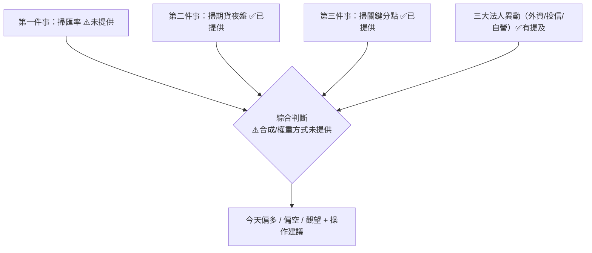
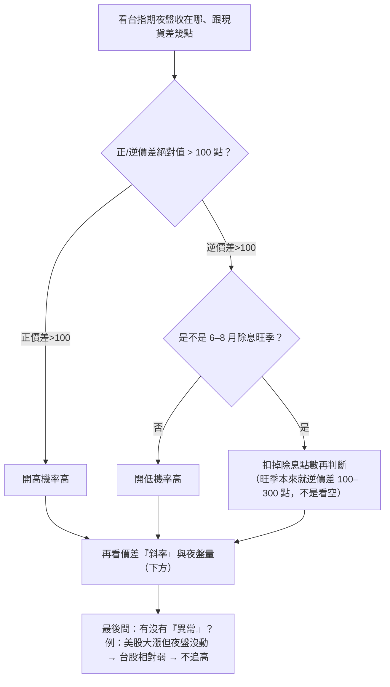
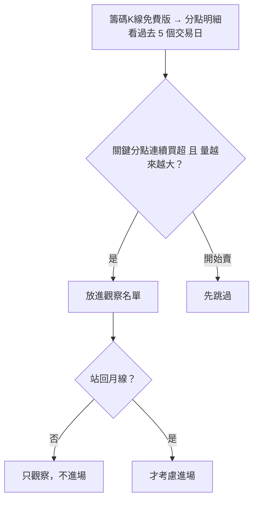

# 發想原文的判斷邏輯與訊號權重（整理 + 缺口）

> 來源：使用者貼出的原文片段（「第二件事 掃期貨夜盤」「第三件事 掃關鍵分點」）+ 已編碼門檻。
> ⚠️ 標記處＝我手上**沒有原文**、需要補。整理日期 2026-06-16。

## 0. 整體框架（推測，待原文確認）

原文像是一份「**開盤前的盤前檢查清單**」，分成幾「件事」各自獨立掃描，最後**綜合判斷今天偏多/偏空**。
已知至少有：

核心心法（貫穿全文）：**「重點不是看漲跌，是看有沒有異常」**、**「除非站回月線否則不進場」**（值得觀察 ≠ 進場）。

---

## 1. 第二件事：掃期貨夜盤（✅ 原文完整）

**判斷條件（原文）：**
- 工具：XQ / 三竹免費版。看夜盤收盤、與現貨價差。
- **±100 點門檻**：正價差 >100 → 開高機率高；逆價差 >100 → 開低機率高。
- **除息例外（作者花 200 點學費）**：每年 6–8 月除息旺季，台指期本來就逆價差 100–300 點，是正常現象，**要扣除息點數再判斷**，不能看到逆價差就空。
- **看異常 > 看漲跌**：美股大漲但夜盤沒動 → 台股相對弱勢 → 不建議追高。
- **外資期貨留倉**：例（上週四）外資期貨空單 3.48 萬口，較前一週少 5 千多口，但仍 >3 萬口 → 方向偏空。

**第 5 點 價差『斜率』（原文標「一定要做」）：**
| 形態 | 解讀 | 操作 |
|---|---|---|
| 慢慢擴大（+50→+120） | 市場有共識看多，開高續強 | 可追 |
| 最後一小時爆衝（+80→+150） | 程式單/軋空，隔天開高爆量出貨 | 不要追 |
| 高檔收斂（+150→+100） | 有人夜盤就先跑了 | 隔天易開高走低 |

**第 6 點 夜盤成交量（原文標「一定要做」），跟近 5 日均量比：**
| 量能 | 解讀 | 操作 |
|---|---|---|
| 爆量(>1.5倍) 且 價差擴大 | 大戶提前佈局 | 順著做勝率高 |
| 爆量 但 價差沒動 | 多空打架 | 開盤等 9:15 方向出來 |
| 量縮 | 市場在等，開盤波動大 | 先看 5 分鐘再動作 |

---

## 2. 第三件事：掃關鍵分點（✅ 原文完整）

**重點盯的分點（已寫入 broker_tags）：**
- 兆豐-嘉義＝長線主力（連買 3–5 天後抱 1–2 個月）
- 凱基-台北＝隔日沖高手（今買明賣 → 不追）
- 永豐金-萬盛＝波段王
- （延伸：對敲假量不碰、隔日沖買超不追）

**心法**：連買且量增 → 觀察；轉賣 → 跳過。「盤勢空但個股有籌碼」（外資反手大買某股）仍只是**值得觀察**，
**除非站回月線否則不進場**（友達案例：當天外資大買但股價仍跌）。

**觀念釐清**：三大法人（外資/投信/自營，身分別）≠ 分點（券商分公司，背後是主力/大戶），是兩個不同維度。

---

## 3. ⚠️ 缺口（請補原文，我才能把第一份做完整）

1. **第一件事（應該是「掃匯率」）全文** —— 我只從門檻推得「台幣變動 0.1」這個數字，但作者怎麼判斷台幣/亞幣、看什麼、門檻怎麼來，沒有原文。
2. **整體綜合與權重** —— 各「件事」掃完後，作者**怎麼合成出今天偏多/偏空 + 信心**？是計分？是一票否決？哪個維度權重最大？這是你最想理解的「他怎麼思考」，但片段裡沒有。
3. **是否還有其他「件事」**（如美股、消息面、技術線型）與前後文框架。
4. **進出場/部位規則**（除了「站回月線才進場」之外的停損、加減碼）。

把原文貼給我，我就能把這份補成完整版，並更新 `logic_code.md` 的「與原文落差」對照。
