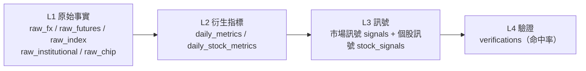
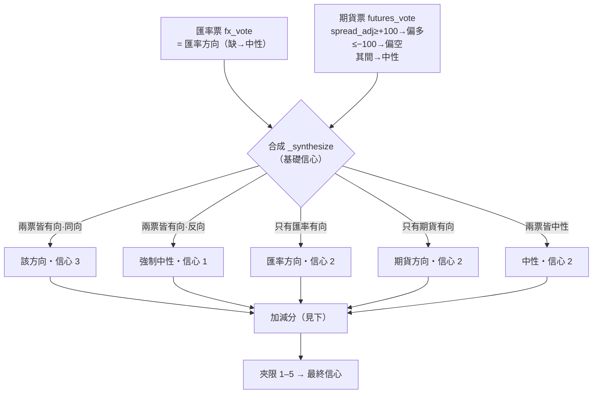
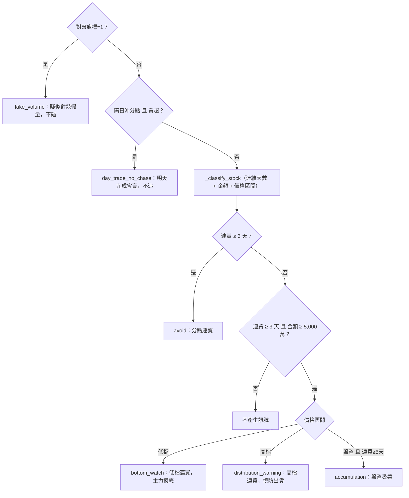

# 目前代碼的判斷邏輯與訊號權重（規則 v1）

> 從程式碼逆向整理（2026-06-16）。門檻全在 `config/settings.py`，改門檻要 bump `SIGNAL_RULE_VERSION`。
> 對照原文邏輯見 `docs/logic_article.md`；文末有「與原文的落差」。

## 0. 總覽：四層管線

全部是純函數：`recompute(date) = f(raw, config)`。下面每一步都標「輸入 → 規則 → 輸出」。

---

## 1. L2 衍生指標（從 raw 算）

### 1.1 匯率 `compute_fx_metrics`
- **delta(幣別)** = 今日 `quote_0845`（08:45 報價）− **前一交易日** `close_16`（16:00 收盤）。三幣各算：USD/TWD、USD/CNY、USD/KRW。
- **方向（以台幣為準）**：`delta < −0.1` → 偏多(bullish)；`delta > +0.1` → 偏空(bearish)；其間 → 中性。
  （門檻 `FX_THRESHOLD_TWD=0.1`、CNY=0.005、KRW=5.0）
  - 邏輯：台幣升值（USD/TWD 下跌、delta 負）= 資金流入 = 偏多。
- **亞幣同步 asia_sync**：三幣方向**全同** → 1；非空方向 <2 個 → None；其餘 → 0。

### 1.2 期貨 `compute_futures_metrics`
- **價差 spread** = 今日夜盤 `night_close` − **前一交易日** 現貨 `spot_close`。
- **除息調整 spread_adjusted** = `spread − 除息預估點數`（除息點數缺則不調整）。
- **夜盤量比 volume_ratio** = 今日夜盤量 ÷ 近 5 日夜盤均量（`FUTURES_VOLUME_LOOKBACK=5`）。
- **外資未平倉 oi_net_foreign** = **前一交易日**收盤的外資淨未平倉（訊號時點已知的最新部位）；`oi_delta` = 其相對再前一交易日的增減。

### 1.3 籌碼/分點 `compute_chip_metrics`（每個分點，排除 __FOREIGN__/__PRICE_ONLY__）
- 買賣超金額、**連續同向天數**、MA20 偏離 → **價格區間 price_zone**（low<−20% / consolidation ±5% / high>+20%）、**對敲旗標**（同分點買賣兩邊都有量）、分點類型（broker_tags）。

---

## 2. L3 市場訊號 `compute_market_signal`（核心權重）

**加減分（依序累加，最後夾限 1–5）：**

| # | 條件 | 調整 | 理由 |
|---|------|------|------|
| 1a | 亞幣同步=1 **且** 與訊號同向 | **+1** | 亞幣同步，買盤較持續 |
| 1b | 亞幣同步=0 **且** 台幣有方向 | **−1** | 只有台幣動，買盤恐不持續 |
| 2a | 夜盤量比 ≥ 1.5 **且** 期貨票有方向 | **+1** | 夜盤爆量，大戶佈局 |
| 2b | 夜盤量比 ≤ 0.7 | **−1** | 夜盤量縮，市場觀望 |
| 3a | 偏多 **且** 外資 OI ≤ −30,000 口 | **−1** | 外資淨空仍偏空 |
| 3b | 偏空 **且** 外資 OI ≥ +30,000 口 | **−1** | 外資淨多仍偏多 |
| 4 | 台幣貶 + 人民幣貶 + 韓元升 | **−1** | 外資可能賣台買韓（警示） |

- 基礎信心來自合成（3/2/1），加減分後 `max(1, min(5, 信心))`。
- 每筆訊號記 `rule_version`，理由逐條存進 `reasons`。

---

## 3. L3 個股觀察訊號 `compute_stock_signals`（每檔×每分點）

門檻：`STOCK_CONSECUTIVE_MIN=3`、`STOCK_NET_AMOUNT_MIN=5,000萬`、`STOCK_ACCUMULATION_MIN=5`。

---

## 4. L4 驗證 `verify_signal`
雙基準三分類（漲/跌/平以 ±0.3% 為界）：主基準=當日收盤漲跌、輔基準=開盤跳空；
比對早上訊號方向是否命中，累積命中率（依信心度分桶統計）。

---

## 5. 與原文的落差（給你收斂用）

| 原文有的判斷 | 代碼現況 |
|---|---|
| 期貨正/逆價差 ±100 點 | ✅ 一致（`FUTURES_SPREAD_THRESHOLD=100`） |
| 除息旺季要扣除息點數 | ✅ 一致（`spread_adjusted = spread − 除息點數`） |
| 夜盤量比 1.5 倍 → 大戶佈局 | ✅ 一致（`VOLUME_RATIO_HIGH=1.5`） |
| 外資期貨空單 3 萬口 → 偏空 | ✅ 一致（`OI_BEARISH_THRESHOLD=−30000`） |
| 隔日沖不追 / 對敲不碰 / 低檔連買放觀察 | ✅ 規則已建（但缺分點資料源） |
| **價差斜率**（慢慢擴大可追 / 最後一小時爆衝不追 / 高檔收斂開高走低） | ❌ **未實作**——只用收盤那一個價差數字，沒有夜盤盤中軌跡 |
| **看異常**（美股大漲但夜盤沒動→台股弱不追高） | ❌ **未實作**——沒有 S&P 500 vs 台指夜盤的背離判斷（有收 sp500_close 但沒用） |
| 量縮 → 開盤先看 5 分鐘 / 爆量但價差沒動 → 等 9:15 | ⚠️ 屬盤中操作建議，本系統定位不做盤中（量縮只做 −1 信心） |
| 整體如何合成偏多/偏空/權重 | ⚠️ 代碼用「兩票合成 + 加減分」；原文的合成方式我手上沒有（見 logic_article.md 缺口） |
| KRW 背離警示（台貶人貶韓升 −1） | ⚠️ 代碼**多**的一條，原文（你貼的段落）未提，可能在未貼的匯率段或是先前發想 |
