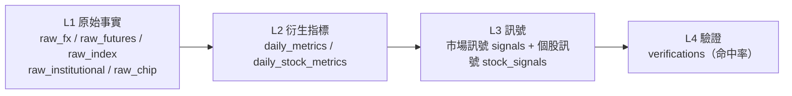
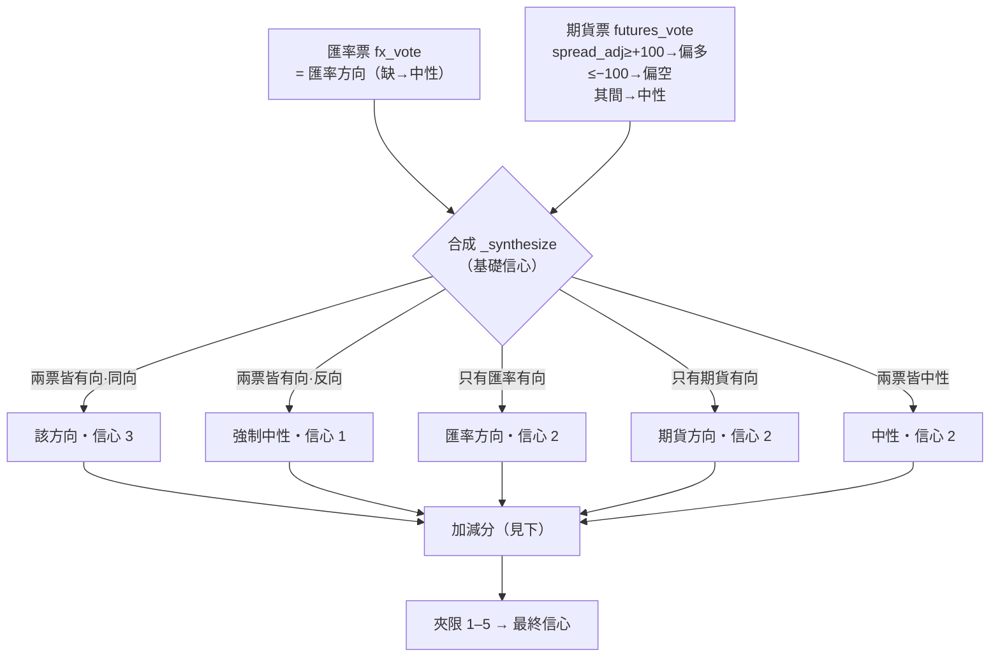
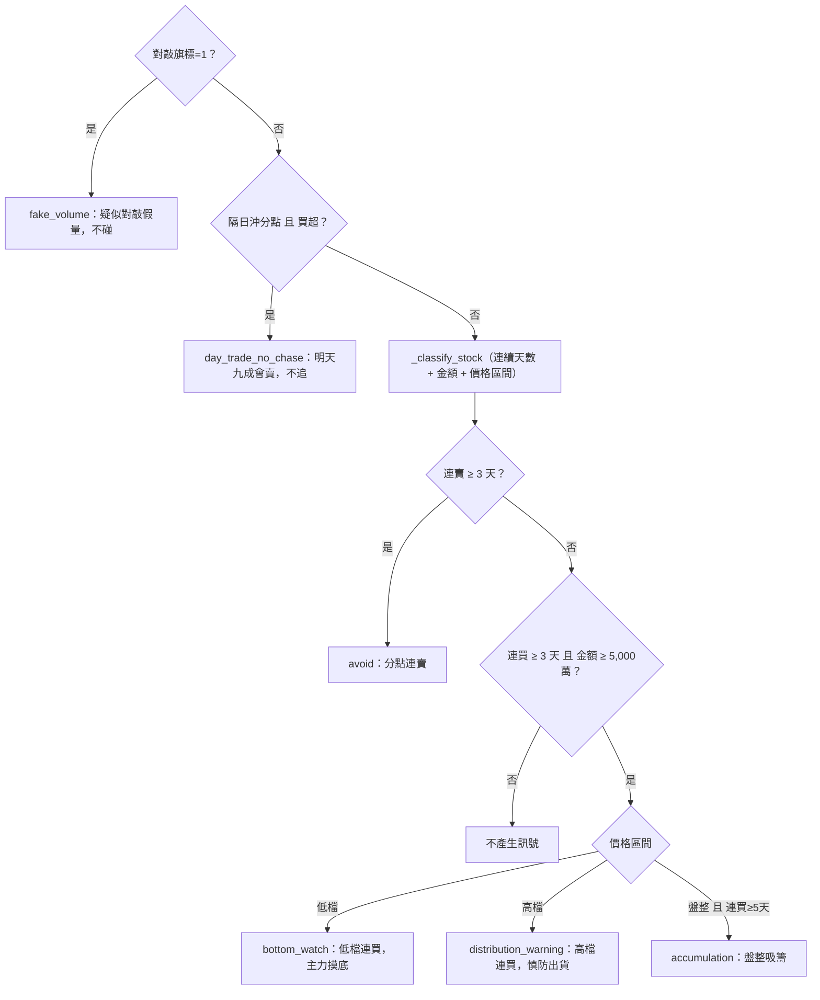

# 目前代碼的判斷邏輯與訊號權重（規則 v1）

> 從程式碼逆向整理（2026-06-16）。門檻全在 `config/settings.py`，改門檻要 bump `SIGNAL_RULE_VERSION`。
> 對照原文邏輯見 `docs/logic_article.md`；文末有「與原文的落差」。

## 0. 總覽：四層管線

全部是純函數：`recompute(date) = f(raw, config)`。下面每一步都標「輸入 → 規則 → 輸出」。

---

## 1. L2 衍生指標（從 raw 算）

### 1.1 匯率 `compute_fx_metrics`
- **delta(幣別)** = 今日 `quote_0845`（08:45 報價）− **前一交易日** `close_16`（16:00 收盤）。三幣各算：USD/TWD、USD/CNY、USD/KRW。
- **方向（以台幣為準）**：`delta < −0.1` → 偏多(bullish)；`delta > +0.1` → 偏空(bearish)；其間 → 中性。
  （門檻 `FX_THRESHOLD_TWD=0.1`、CNY=0.005、KRW=5.0）
  - 邏輯：台幣升值（USD/TWD 下跌、delta 負）= 資金流入 = 偏多。
- **亞幣同步 asia_sync**：三幣方向**全同** → 1；非空方向 <2 個 → None；其餘 → 0。

### 1.2 期貨 `compute_futures_metrics`
- **價差 spread** = 今日夜盤 `night_close` − **前一交易日** 現貨 `spot_close`。
- **除息調整 spread_adjusted** = `spread − 除息預估點數`（除息點數缺則不調整）。
- **夜盤量比 volume_ratio** = 今日夜盤量 ÷ 近 5 日夜盤均量（`FUTURES_VOLUME_LOOKBACK=5`）。
- **外資未平倉 oi_net_foreign** = **前一交易日**收盤的外資淨未平倉（訊號時點已知的最新部位）；`oi_delta` = 其相對再前一交易日的增減。

### 1.3 籌碼/分點 `compute_chip_metrics`（每個分點，排除 __FOREIGN__/__PRICE_ONLY__）
- 買賣超金額、**連續同向天數**、MA20 偏離 → **價格區間 price_zone**（low<−20% / consolidation ±5% / high>+20%）、**對敲旗標**（同分點買賣兩邊都有量）、分點類型（broker_tags）。

---

## 2. L3 市場訊號 `compute_market_signal`（核心權重）

**加減分（依序累加，最後夾限 1–5）：**

| # | 條件 | 調整 | 理由 |
|---|------|------|------|
| 1a | 亞幣同步=1 **且** 與訊號同向 | **+1** | 亞幣同步，買盤較持續 |
| 1b | 亞幣同步=0 **且** 台幣有方向 | **−1** | 只有台幣動，買盤恐不持續 |
| 2a | 夜盤量比 ≥ 1.5 **且** 期貨票有方向 | **+1** | 夜盤爆量，大戶佈局 |
| 2b | 夜盤量比 ≤ 0.7 | **−1** | 夜盤量縮，市場觀望 |
| 3a | 偏多 **且** 外資 OI ≤ −30,000 口 | **−1** | 外資淨空仍偏空 |
| 3b | 偏空 **且** 外資 OI ≥ +30,000 口 | **−1** | 外資淨多仍偏多 |
| 4 | 台幣貶 + 人民幣貶 + 韓元升 | **−1** | 外資可能賣台買韓（警示） |

- 基礎信心來自合成（3/2/1），加減分後 `max(1, min(5, 信心))`。
- 每筆訊號記 `rule_version`，理由逐條存進 `reasons`。

---

## 3. L3 個股觀察訊號 `compute_stock_signals`（每檔×每分點）

門檻：`STOCK_CONSECUTIVE_MIN=3`、`STOCK_NET_AMOUNT_MIN=5,000萬`、`STOCK_ACCUMULATION_MIN=5`。

---

## 4. L4 驗證 `verify_signal`
雙基準三分類（漲/跌/平以 ±0.3% 為界）：主基準=當日收盤漲跌、輔基準=開盤跳空；
比對早上訊號方向是否命中，累積命中率（依信心度分桶統計）。

---

## 5. 與原文的落差（完整對照，給你收斂用）

> 已比對完整原文。最關鍵的結構差異在最後一列。

### 匯率
| 原文 | 級別 | 代碼 |
|---|---|---|
| 升貶 0.1 → 多/空/中性 | 主判斷 | ✅ 一致（`FX_THRESHOLD_TWD=0.1`），但基準是「前一交易日 close_16」——原文是「前一天 16:00」，相符 |
| 亞幣同步（三幣一起升/只台幣升/台貶人貶韓升） | 一定要做 | ✅ 有（`fx_asia_sync` + `_krw_divergence`）。**訂正前次說法：KRW 背離正是原文第一件事②，代碼忠實，不是多的** |
| 升貶**節奏**（5 分 K：緩步/急拉/跳空） | 一定要做 | 🟡 已做（盤前解讀「匯率節奏」列）——用 Yahoo USDTWD=X 5 分序列算跳空(±0.05)/急拉(單根≥0.03)/緩步；註：Yahoo 是**離岸**報價，與台銀 onshore 有小基差，當形狀參考 |
| 央行防線 32 整數 | 進階 | ❌ 未做 |
| 紐約盤對照 | 高手區 | ❌ 未做（`raw_fx.ny_close` 欄位預留、沒收沒用） |

### 期貨夜盤
| 原文 | 級別 | 代碼 |
|---|---|---|
| 價差 ±100（扣除息） | 主判斷 | ✅ 一致（`FUTURES_SPREAD_THRESHOLD=100`、`spread_adjusted` 扣除息；但除息源 PARTIAL、目前多回 0） |
| 外資期貨空單 3 萬口 | 主判斷 | ✅ 一致（`OI_BEARISH/BULLISH_THRESHOLD=±30000`） |
| **價差斜率**（擴大可追/爆衝不追/收斂開高走低） | 一定要做 | ❌ 未做——需台指期**夜盤(15:00–05:00)逐筆軌跡**，MIS 只在現貨時段、TAIFEX 無免費單次盤中序列源；待夜盤逐筆源 |
| 夜盤量比 1.5 倍 | 一定要做 | ✅ 一致（`VOLUME_RATIO_HIGH=1.5`）。但「量縮看5分鐘/等9:15」屬盤中、不做（量縮只 −1 信心） |
| **看異常**（美股大漲但夜盤沒動） | 心法 | ❌ 未做——`sp500_close` 有收但沒拿來跟台指夜盤比背離 |
| 富台指對照 | 進階 | ❌ 未做（`raw_futures.ftse_tw_close` 欄位預留、沒收） |

### 分點/籌碼
| 原文 | 級別 | 代碼 |
|---|---|---|
| 看金額不看張數 | 一定要做 | ✅ 一致（`net_amount` 是金額、門檻 5,000 萬） |
| 連買天數 × 股價位置（摸底/出貨/吸籌） | 一定要做 | ✅ 一致（`consecutive` + `price_zone` low/high/consolidation） |
| 隔日沖不追 | 進階 | ✅ 有（`broker_type=day_trade` 買超→不追） |
| 分點慣性：波段/避險 | 進階 | 🟡 部分——`broker_tags` 有 swing/hedge，但訊號只特別處理 day_trade，swing/hedge 沒專屬規則 |
| 對敲不碰 | — | 🟡 近似——代碼是「同分點買賣兩邊都有量」；原文是「同分點同時在買超+賣超前五名」 |
| 假明牌（買超但收黑K/長上影） | 高手區 | ❌ 未做 |
| （全部分點規則） | — | ⚠️ 缺資料源（FinMind 付費 / 手動匯入） |

### 🔴 最關鍵的結構差異
| 面向 | 原文 | 代碼 |
|---|---|---|
| **怎麼合成最終判斷** | **沒有公式**——三件事是檢查清單，做完靠人「心裡有個底」下定性判斷、筆記一句話 | **自創計分**：兩票合成（3/2/1）+ 加減分（亞幣/量比/OI/背離）+ 夾限 1–5 |

→ 代碼把「人為定性」硬做成「可重現的計分」。這有好處（可驗證命中率、可回溯），但也是你要決定的：
**你的模型要沿用這套計分、還是改成更貼近原文的「分級檢查 + 你自己的權重」？** 這就是你要內化、做出自己見解的地方。

