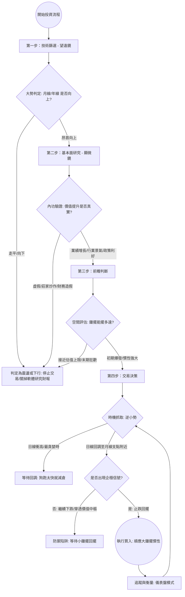

# 趨勢／個股投資流程的判斷邏輯（趨勢層來源）

> 來源：使用者提供的影片（NotebookLM 還原）。這是 **個股趨勢層（spec v2）** 的方法論來源，
> 與〈開盤前三件事〉(`docs/logic_article.md`，大盤訊號來源) 是**兩套獨立方法論**。
> 對照代碼見 `integration/trend_signal.py`、規格見 `windscope-trend-signal-spec-v2.md`。
> ⚠️ 門檻皆為起始值須回測；先假設原文為真、累積數據驗證其可靠性。非投資建議。

## 0. 核心心法（比喻）

| 比喻 | 意思 | 對應工程量 |
|---|---|---|
| **鐘擺理論** | 股價像鐘擺，繞著「價值中樞」在兩側擺盪：貪婪時擺過頭（超買）、恐慌時擺過頭（跌破）。 | 價值中樞＝月線 MA20；乖離 = (收盤−月線)/月線 |
| **牽狗理論** | 主人（大勢／年線）牽著狗（股價／日線）散步。狗會暴衝或落後，但總被繩子拉回主人身邊。 | 主人＝年線 MA240 斜率（大勢方向）；狗＝日線對月線的乖離 |
| **望遠鏡 vs 顯微鏡** | 望遠鏡看**大勢方向**（技術面篩選）；顯微鏡看**內功**（基本面驗證價值是否真實）。 | 望遠鏡＝趨勢三態；顯微鏡＝fundamental_gate（**目前預留**，無基本面資料源） |
| **順大勢、逆小勢** | 順著大鐘擺的慣性（做多上升趨勢）；逆著小鐘擺（衝高不追、回調才進）。 | 大勢 UP 才考慮做多；小勢超買→不追、回踩月線+企穩→關注 |
| **內功 vs 外功** | 外功＝技術面／K線位置；內功＝基本面／財報。底部判斷**光靠技術不可能**，須配內功。 | 出場綁「大勢轉向」或「內功轉壞」，**無固定 % 技術止損** |

---

## 1. 四步決策流程

### 步驟拆解

1. **第一步 技術篩選（望遠鏡）**：月線/年線是否昂首向上？走平/向下 → 判為震盪或下行，**停止交易、去研究財報**；昂首向上 → 進第二步。
2. **第二步 基本面研究（顯微鏡）**：價值提升是否真實？虛假/莊家炒作/財務造假 → 迴避；業績增長/行業景氣/政策利好 → 進第三步。
3. **第三步 前瞻判斷（空間評估）**：鐘擺還能擺多遠？接近估值上限/末期狂歡 → 迴避；初期爆發/慣性強大 → 進第四步。
4. **第四步 交易決策（順大勢、逆小勢）**：抓時機。日線衝高（最貪婪）→ 等待回調、狗跑太快就減倉；日線回調到月線支點附近 → 看**企穩信號**：仍續跌/穿透價值中樞 → 防禦陷阱、等小鐘擺回擺；止跌回擺 → **執行買入**，順應大鐘擺慣性。
5. **監測**：買入後進「儀表盤模式」追蹤與衡量，回到第四步持續評估加減倉／出場。

---

## 2. 對照 windscope 實作（誠實標註）

| 步驟 | 影片方法論 | windscope 目前 |
|---|---|---|
| 第一步 望遠鏡 | 月線/年線向上 | ✅ **趨勢三態** UP/DOWN/FLAT（年線斜率 + FLAT 三症狀投票 + 遲滯確認） |
| 第二步 顯微鏡 | 基本面驗證內功 | 🔲 **預留**：`fundamental_gate` 恆 UNKNOWN（無基本面資料源）→ 保守不放行「關注建倉區」，導去「修內功」 |
| 第三步 空間 | 估值上限 / 鐘擺空間 | 🔲 **未實作**；以「超買乖離」近似（狗跑太遠→不宜追高、減倉） |
| 第四步 時機 | 順大勢逆小勢 + 企穩 | ✅ **順大勢逆小勢 routing** + MA5 轉升（企穩近似）+ 加減倉提示 |
| 出場 | 大勢轉向 / 內功轉壞 | ✅ 綁 big_trend 轉 DOWN/FLAT、gate 轉 FAIL；**無固定 % 止損**（源本就沒有） |

→ 目前自動化的是**第一步與第四步（純技術）**；第二、三步（基本面／估值）是**人工或預留**。
這也是為什麼系統只到「關注建倉區／觀望」等**提示**，不是下單指令——最後仍需人工配合內功定性判斷。
